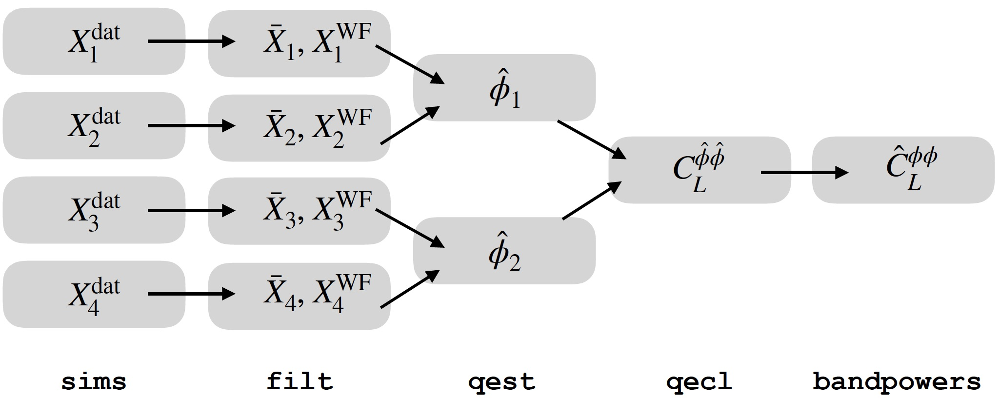

.. plancklens documentation master file, created by
   sphinx-quickstart on Thu Oct 25 22:29:12 2018.
   You can adapt this file completely to your liking, but it should at least
   contain the root `toctree` directive.

Welcome to plancklens documentation!
====================================

.. toctree::
   :maxdepth: 2
   :caption: Contents:

   sims
   filt
   qest
   qecl
   bandpowers
   n0
   n1
   qresp

Indices and tables
==================

* :ref:`genindex`
* :ref:`modindex`
* :ref:`search`
